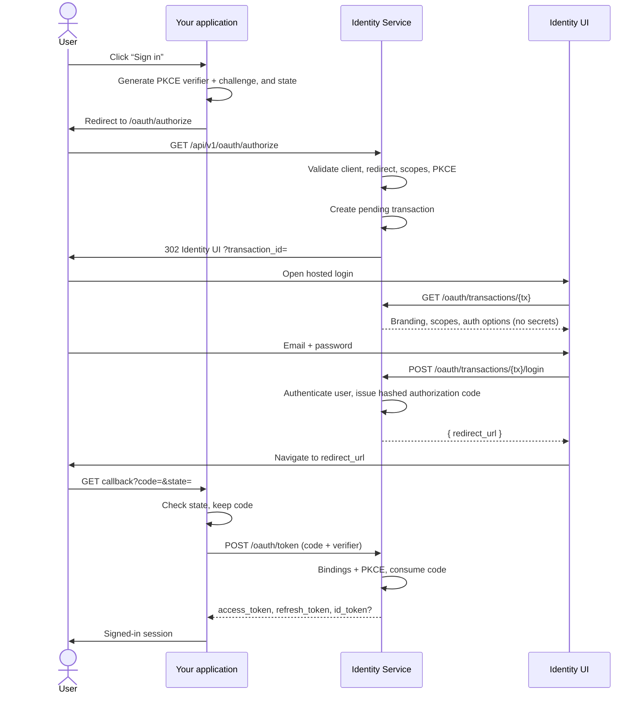

# OAuth lifecycle

This is the authorization-code flow with PKCE and optional OpenID Connect.
It is the path where the browser leaves your application, signs in on the
hosted Identity UI, and comes back with a code — never with tokens.

If you have not registered an application and a redirect URI yet, start
with [Create an application](create-an-app.md).

## Who does what

```
Your application          Identity Service              Identity UI
(OAuth client)            (IdP / this repo)             (hosted login)

starts login              checks the request            shows the form
keeps the PKCE verifier   opens a transaction           never sees secrets
receives code + state     issues the code               never sees tokens
exchanges code            signs access / refresh / id
calls your own APIs
```

Identity Service is the identity provider. Identity UI is only the pages
the user types into. Your application is the only party that should ever
hold the client secret or the PKCE verifier.

## The happy path



### 1. Your application starts the request

Generate a high-entropy `code_verifier` (43–128 unreserved characters) and
derive the challenge:

```
code_challenge = base64url(sha256(code_verifier))   # no padding
```

Also generate an opaque `state` you can recognize on the way back. If you
want replay protection on the ID token, generate a `nonce` too.

Redirect the browser to:

```
GET /api/v1/oauth/authorize
  ?client_id=<client_id>
  &redirect_uri=<exactly registered callback>
  &response_type=code
  &scope=openid profile email
  &state=<your state>
  &nonce=<optional>
  &code_challenge=<S256 challenge>
  &code_challenge_method=S256
```

`response_type` must be `code`. Implicit (`token`, `id_token`) is rejected.
PKCE method must be `S256`; `plain` is rejected. Every requested scope must
be in the application's `allowed_scopes`. Scopes are not defaulted — ask
for the ones you want. Include `openid` if you need an ID token.

Keep the verifier on your server (or in a secure cookie you set). Do not
put it on the authorize URL.

PKCE is required for every authorization-code request, including
confidential clients. `code_challenge_method` must be `S256`.

### 2. Identity Service opens a transaction

Before anything is written, the service checks:

- the `client_id` exists and the application is active
- `redirect_uri` is on the application's list (exact match)
- `response_type` is `code`
- the PKCE method is `S256`
- every scope is allowed

If the redirect URI is known and a later check fails, the browser is sent
back to that URI with `error`, `error_description`, and `state`. The
application configuration is never placed on a URL.

The service also checks that the `authorization_code` grant is enabled
for the application. If it is not, and the redirect URI is registered,
the browser is sent back with `unauthorized_client`.

On success a row is written to `oauth_transactions` in state `pending`.
The browser is redirected to the Identity UI with only the transaction id:

```
302  {IDENTITY_UI_BASE_URL}/authorize?transaction_id=tx_…
```

The transaction holds the PKCE challenge, redirect URI, scopes, `state`,
and `nonce`. Those values stay on the server for the rest of the flow.

### 3. Identity UI authenticates the person

The UI loads a safe view of the transaction:

```
GET /api/v1/oauth/transactions/{transaction_id}
```

That payload is branding, requested scopes, and the application's auth
options (`allow_signup`, `allow_password_login`,
`require_email_verification`). It does not include `code_challenge`,
`nonce`, `state`, or the client secret.

The UI then posts to one of the transaction endpoints:

| Action | Endpoint |
| --- | --- |
| Sign in | `POST /transactions/{tx}/login` |
| Create an account | `POST /transactions/{tx}/signup` |
| Start password reset | `POST /transactions/{tx}/forgot-password` |
| Finish password reset | `POST /transactions/{tx}/reset-password` |
| Confirm email | `POST /transactions/{tx}/verify-email` |
| Abort | `POST /transactions/{tx}/cancel` |

Login and signup never return tokens. On success they return either:

```json
{ "redirect_url": "https://app.example.com/callback?code=code_…&state=…", "email_verification_required": false }
```

or, when the application requires a verified email and this user has not
verified yet:

```json
{ "redirect_url": null, "email_verification_required": true }
```

The UI is expected to navigate to `redirect_url` when it is present.

### 4. The callback carries only a code

```
GET https://app.example.com/callback?code=code_…&state=…
```

Your application checks `state` against the value it stored in step 1.
The callback query string contains `code` and `state` and nothing else —
no access token, no ID token, no secret.

The raw code lives for five minutes (`OAUTH_AUTHORIZATION_CODE_EXPIRATION_MINUTES`)
and can be redeemed once.

### 5. Your application exchanges the code

This call is server-to-server. Form-encoded.

```
POST /api/v1/oauth/token

grant_type=authorization_code
code=<code from the callback>
client_id=<client_id>
redirect_uri=<the same URI as step 1>
code_verifier=<the verifier from step 1>
client_secret=<required for confidential clients>
```

`client_type=public` (the default) does not require `client_secret`.
`client_type=confidential` rejects the request without one. Sending a
wrong secret is always `invalid_client`.

The service checks the code exists, is unexpired and unused, belongs to
this client, matches this redirect URI, that the application is still
active and allows `authorization_code`, that the verifier re-derives the
stored challenge, that the transaction is `completed`, and that the user
still exists. Only then is the code marked used, atomically.

A second redeem of the same code fails with `invalid_grant`.

### 6. Tokens come back

```json
{
  "access_token": "…",
  "refresh_token": "…",
  "token_type": "bearer",
  "expires_in": 900,
  "id_token": "…"
}
```

`id_token` is present only when `openid` was granted. What each token is
for, and how other services verify the access token, is in
[Tokens](tokens.md).

Refresh is not part of this endpoint. Use `POST /api/v1/auth/refresh`.

## Transaction states

A transaction is the server-side record of one in-progress login. It
expires after ten minutes by default.

Written transitions are enforced atomically inside a Firestore
transaction. Two concurrent logins cannot both progress the same
transaction.

```
pending ──claim + issue code──► completed          (no email verification)
pending ──claim──► authenticated ──verify + issue code──► completed
```

```
pending ──► cancelled
authenticated ──► cancelled
pending / authenticated ──► expired   (derived from expires_at, not written as a transition)
```

Invalid transitions fail. A completed or cancelled transaction cannot be
reused for login or signup. An expired transaction cannot proceed.

| State | Meaning | What the UI can do |
| --- | --- | --- |
| `pending` | Request accepted, nobody has signed in | login, signup, forgot-password, cancel |
| `authenticated` | Claimed by one authentication request | verify-email (if required), cancel |
| `completed` | Authorization code has been issued | nothing |
| `cancelled` / `expired` | Dead | nothing |

`expired` is computed from `expires_at` when the row is read. Cleanup of
stale documents is optional and is not what makes them unusable.

Authorization-code issuance happens only after the `pending` →
`authenticated` claim succeeds, and the code row is written in the same
Firestore transaction as `authenticated` → `completed`.

## Email verification

When `authentication.require_email_verification` is true and the user is
unverified, login and signup stop at `authenticated`. A verification
token is emailed (in development the notification is logged, not sent).
The user follows the link, the UI posts the token to
`/transactions/{tx}/verify-email`, and the flow continues to a code.

The verification token is stored only as a hash, is single-use, and is
bound to the application and user that requested it. A token minted for
application A cannot advance a transaction for application B.

The transaction remains bound to its original client, redirect URI, PKCE
challenge, and scopes throughout.

## Password reset

Forgot-password is enumeration-safe: the response is identical whether
or not the email has an account. If it does, a hashed reset token is
stored and a link is emailed.

The user can finish the reset inside the transaction
(`/transactions/{tx}/reset-password`) or, if they open the email later,
at the standalone `POST /api/v1/oauth/password/reset`. Resetting a
password revokes that user's refresh tokens.

## What each party is allowed to hold

| Secret | Your application | Identity Service | Identity UI | Browser URL |
| --- | --- | --- | --- | --- |
| `client_secret` | yes (confidential clients) | hash only | no | no |
| PKCE verifier | yes | no | no | no |
| PKCE challenge | sent once | stored on the transaction and the code | no | no |
| Authorization code | after callback | hash only | briefly, as `redirect_url` | callback query |
| Access / refresh / ID tokens | after `/token` | signed, not stored (refresh row is stored) | no | no |
| User password | only on the direct-auth path | Argon2id hash | in memory during submit | no |

## When something goes wrong

If the authorize request is invalid *and* the redirect URI is registered,
the user lands on your callback with:

```
?error=invalid_scope&error_description=…&state=…
```

If the redirect URI itself is wrong, there is nowhere safe to send the
browser, so the service returns a JSON error instead of redirecting.

Token-endpoint and transaction failures are JSON:

```json
{ "error": "invalid_grant", "error_description": "Authorization code has already been used" }
```

The full list is in [Reference](reference.md#errors).
